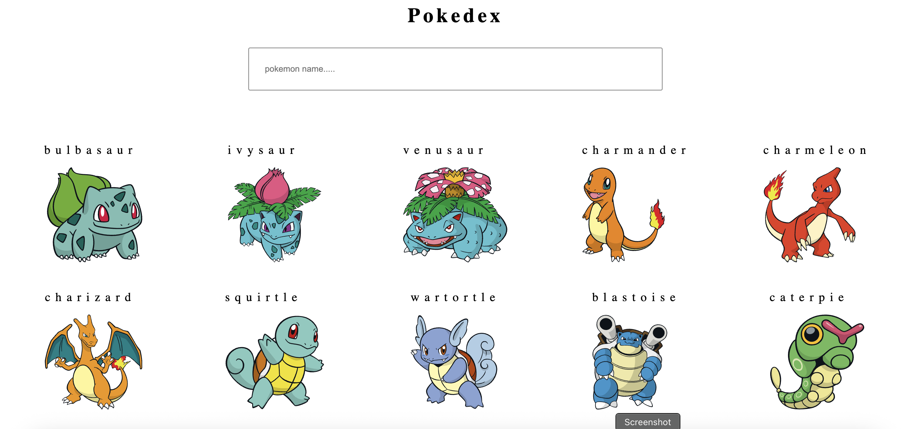

🧬 Pokedex – React JS Web App
Pokedex is a frontend web application built using React JS that allows users to explore various Pokémon and view their detailed attributes. The app fetches real-time data from the PokeAPI and displays key Pokémon information such as name, type, height, and weight using clean UI and dynamic routing.

🌐 Live Demo
🔗 https://pokedex-project-livid.vercel.app/

✨ Features
🎴 Explore a wide variety of Pokémon

🔍 Detailed view for each Pokémon including:

📛 Name

🧱 Type(s)

📏 Height

⚖️ Weight

🚦 Routing for navigating between list and detail views

🧩 Dynamic URL parameters using useParams

⚙️ API data fetched using Axios from PokeAPI

♻️ Hooks-based state and effects using useState and useEffect

⚙️ Tech Stack
⚛️ React JS

🧠 useState, useEffect

🧭 React Router DOM

🔄 Axios for API calls

🎨 CSS for styling

